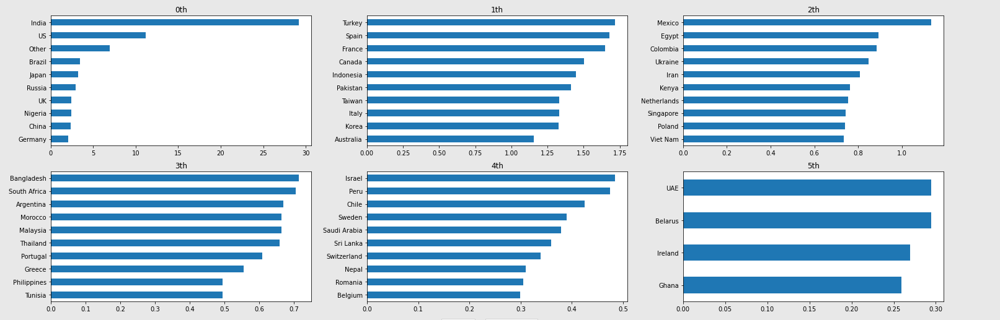
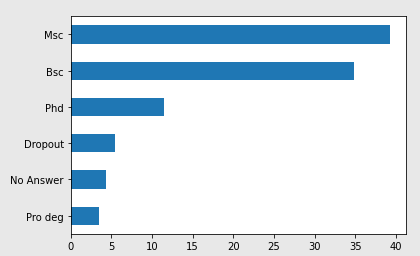
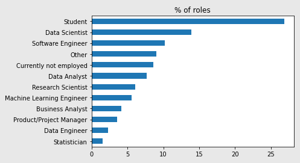
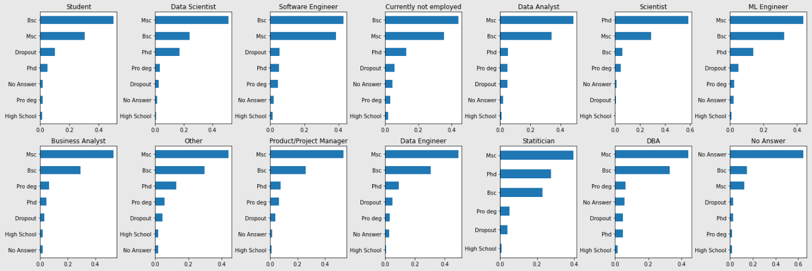
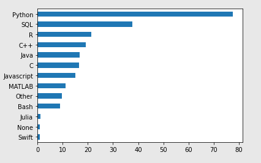
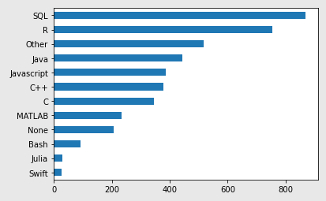
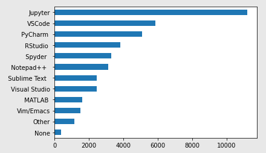
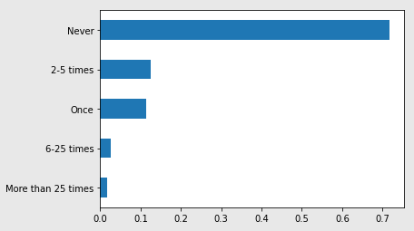
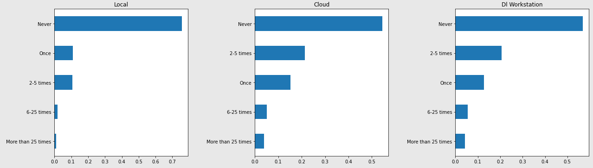

# 2020 Kaggle Machine Learning & Data Science Survey

## Context
Code within this repository is the work I have done to analyze to gain some insight from Kaggle's <a href="https://www.kaggle.com/c/kaggle-survey-2020">Survey Competition</a>. Also, in order to view the original Kaggle Notebook please follow this <a href="https://www.kaggle.com/damoonshahhosseini/brainstorming">link</a>. 

# Data Preprocessing
The survey data has a specific structure where it would be convinient to clean and change some attributes of the dataframe. Some problems:
- Column names are verbose and they are not descriptive. Column names have been changed by replacing '_Part_' and '_' with '.', 'OTHER' with '0':
    ```python
    # Formating the columns for comfortable access
    column_dict = {}

    # Getting the dictionary needed to change the column names
    for col in res.columns:
        n_col = col.replace('_Part_', '.')
        n_col = n_col.replace('_', '.')
        n_col = n_col.replace('OTHER', '0')
        column_dict[col] = n_col
        
    # Rename the columns
    res.rename(columns=column_dict, inplace=True)

    # Getting the uni-option columns/questions
    uo_cols = []
    for col in res.columns[1:]:
        if not '.' in col:
            uo_cols.append(col)
            
    res.drop([0], inplace=True)
    ```
- Most columns are actually options for a question. It would help the analysis to break down the dataframe into subset of questions. This would mean that for each question we will have n columns representing n possible answers (to that question) in the binary format.
    ```python
    def break_down(start_index: int, end_index: int):
        """
            Subsetting the dataframe into questions and binarizing the columns
            
            input: 
                start_index: The start of the subset index
                end_index: The end of the subset index
                
            return:
                dataframe containing the reponses to a given question
        """
        subset = res.iloc[1:, start_index:end_index].copy()
        
        return binary_formatting(subset)

    def binary_formatting(df: pd.DataFrame):
        """
            Binarizing the columns, changing the column names
            
            input:
                df: Dataframe to binarize
            
            return:
                A dataframe of binary columns with answers as their column names
        """
        col_dict = {}
        for col in df.columns:
            val = np.nan
            if pd.isna(df[col].unique()[0]):
                val = df[col].unique()[1]
            else:
                val = df[col].unique()[0]
            
            
            if val == np.nan:
                df[col] = df[col].map({np.nan: 0})
            else:
                df[col] = df[col].map({val: 1, np.nan: 0})
            
            col_dict[col] = val

        df.rename(columns=col_dict, inplace=True)
        
        return df
    ```
- The majority of missing values are because of the multi optional questions but they are some uni-option question with missing values that need imputing. Yet we have to go through each question to find the feasible value to fill the missing values with.
- Some unique values within the columns have verbose entries which can be shortened:

    For instance in the country column, United States of America can be shortened to US, this makes the graphs look neater. Also, I googled South Korea and Republic of Korea are the same thing.
    ```python
    # Shortening some of the names
    country_dict = {
        'United Kingdom of Great Britain and Northern Ireland': 'UK',
        'United States of America': 'US',
        'Republic of Korea': 'Korea',
        'United Arab Emirates': 'UAE',
        'South Korea': 'Korea',
        'Republic of Korea': 'Korea',
        'Iran, Islamic Republic of...': 'Iran'
    }
    res['Q3'] = res['Q3'].replace(country_dict)
    ```

At the end of preprocessing, the data has been cleaned and broken into mutlitple sub-dataframes based on the questions.

This how the functions will used to break down the dataframe
```python
# Mulit-Option Question Break downs
language = break_down(7, 20) # Q7
ide = break_down(21, 33) # Q9
host_prod = break_down(33, 47) # Q10
spec_hardware = break_down(48, 52) # Q12: TPU, GPU
viz_lib = break_down(53, 65) # Q14: Which data visualization lib do u use?
ml_lib =  break_down(66, 82) # Q16: Regularly used ML libraries
algo = break_down(83, 94) # Q17: Regularly used ML Algorithms
comp_vision = break_down(94, 101) # Q18: Algorithms related to Computer Vision
nlp = break_down(101, 107) # Q19: Algorithms related to NLP
work_activity = break_down(110, 118) # Q23
cloud_platform = break_down(120, 132) # 26.a
```

## Analysis Utilities
While going through various questions, it is helpful to visualize the data and try to focus on specific aspect of the data.

The function below is extensively used in my project for visualization:
```python
def order_uni(q: str, title: str, start: int=0, end:int=-1, ax: np.ndarray=None):
    """
        Plots horizontal bar chart of a uni-option question
        
        input:
            q: question number
            title: title of the bar chart
            start: starting index for slicing
            end: ending index for slicing
        
        return:
            horizontal bar chart
    """
    return (res.loc[:, q].value_counts(normalize=True)[start:end].sort_values(ascending=True) * 100).plot.barh(title=title, ax=ax)
```

# Analysis
I don't believe anyone knows if they are going to find something significant when they go through a dataset. I hypothesize that analysis techniques aside, Brain Storming on the data could help the creeative process. And by brainstorming, I mean going through data and trying to challenge your thoughts on the matter.

- Q1: Age
    - Majority of Kagglers are between 25-29 age range
    - It is safe to say that the majority of the Kagglers are between 18-29 years old. The ranges above 30 are in order (30-34 followed by 35-39 and etc.)
    - Interestingly they are some 70+ participatin in Kaggle.

- Q3: Country
    - Kagglers are from 55 different countries (Counting the others).
    - In the first 10 countries with the most Kagglers, India is at the lead. Which is interesting since India and Nigeria are the only two non-first world countries in top 10. In future, we might change our definition of first and second world.
    - Based on China's economy and tech initiatives, one might expect to see China in top five. Yet, interestingly China is below US and India with a large difference.
    - Looking at the data, we can see that people from all over the world are participating
    - If one were to visualize the number of Kaggle participants based on countries, plotting bar charts alongside will help us gain a better understand:
    ```python
    fig, axes = plt.subplots(2, 3, figsize=(10,7))
    fig.tight_layout()

    ax_index = 0

    for i in range(0, 6):
        if i == 3: ax_index += 1
            
        order_uni('Q3', title=f'{i}th', start=i * 10, end=(i+1)*10, ax=axes[ax_index][i%3])

    plt.subplots_adjust(left=0, bottom=None, right=2, top=None, wspace=None, hspace=0.2)
    ```
    <p align="center">
    
    </p>


    ## Relation between infrastructure and Kaggle Participation:
    It is logical to expect the First-word countries have a higher participation rate with in the Kaggle community. It is less likely for people in Syria (where a civil war is going on) to have the time to use Kaggle. I suspect there is also more value to doing Kaggle competitions in First-wolrd countries since the employers will acknowledge your talent given your participation level on Kaggle.
    - India has the most Kagglers. There several factors to consider:
        - India has the 2nd largest population: Because of its large population, even if a smaller proportion of the society were involved on Kaggle still it would could still be at first rank.
        - India is a development country (2nd world): This shows that given India is not a first-world country, it has the needed infrastructure (internet connection, educational resouces, and etc.) for individuals to participate on Kaggle. Same thing is true about Nigeria.
    - Nigeria: It is one of the two development countries in top 10. Which implies that Nigerians have the infrastructure and are motivated enough to participate on kaggle.
    - As we go down the list, we see less First-World countries and more development countries. We even come across some Third-World coutnries (Iran).


- Q4: Education
    - The Majority of Kagglers have a Masters and Bachelor. This makes sense based on the age data which ages 18-25 are the range for these students. The percentage break down of the degrees:
    <p align="center">
        
    </p>

    - Also just a cleaning note for optimizing analysis process:
    
    ```python
    # Renaming the Values
    res.loc[:, 'Q4'].replace(inplace=True, to_replace={
        'Doctoral degree': 'Phd',
        'Master’s degree': 'Msc',
        'Bachelor’s degree': 'Bsc',
        'No formal education past high school': 'High School',
        'Some college/university study without earning a bachelor’s degree': 'Dropout',
        'I prefer not to answer': 'No Answer',
        'Professional degree': 'Pro deg',
        np.nan: 'No Answer' # Imputing the missing values
    })
    ```


- Q5: Role
    some pre-analysis questions:
    - Does degree affect role?
    - What role does age play in one's role?

    1. Students have the majority:
        - More than 50% percent of the student are working towards their Bs (or have a Bs).
        - 2nd largest % goes to Msc (which is kind of predictable).
        - Yet the third largest portion are dropouts.

        <p align="center">
            
        </p>
    2. Data Scientist:
        - Half (almost) of the Data Scientist have a Msc.
        - The number of Bsc and Phd students are relatively close.
        - The number of Msc students with Data Science title suggests that Msc is kind of a requirement to become a Data Scientist. And I say kind of because it is obviously possible to get a Data Science job with lower educational degree, yet based on the ovserved trend majority of technical roles are given to Msc.

        

    - By Looking at the graphs, we can see that Msc can be really helpful to get a job. Only Software Engineer role has more Bsc than Msc. This implies that Software engineering might not need a strong background and knowledge that a Data-related job might need.
    - Research Scientist role has Phd degree at the top with almost 60%. This implies that higher education has an important correlation with becoming a research Scientist. Also, Phd is only the first rank in this role, hence we can say that research scientist is the most technical role one can have in data-related jobs.

    ```python
    fig, (r1, r2) = plt.subplots(2, 7, figsize=(10,7))
    fig.tight_layout()

    # Row 1:
    res[res['Q5'] == 'Student']['Q4'].value_counts(normalize=True).sort_values().plot.barh(title="Student",ax = r1[0])
    res[res['Q5'] == 'Data Scientist']['Q4'].value_counts(normalize=True).sort_values().plot.barh(title="Data Scientist", ax=r1[1])
    res[res['Q5'] == 'Software Engineer']['Q4'].value_counts(normalize=True).sort_values().plot.barh(title="Software Engineer", ax=r1[2])
    res[res['Q5'] == 'Other']['Q4'].value_counts(normalize=True).sort_values().plot.barh(title="Other", ax=r1[3])
    res[res['Q5'] == 'Currently not employed']['Q4'].value_counts(normalize=True).sort_values().plot.barh(title="Currently not employed", ax=r1[3])
    res[res['Q5'] == 'Data Analyst']['Q4'].value_counts(normalize=True).sort_values().plot.barh(title="Data Analyst", ax=r1[4])
    res[res['Q5'] == 'Research Scientist']['Q4'].value_counts(normalize=True).sort_values().plot.barh(title="Scientist",ax = r1[5])
    res[res['Q5'] == 'Machine Learning Engineer']['Q4'].value_counts(normalize=True).sort_values().plot.barh(title="ML Engineer", ax=r1[6])
    # Row 2:
    res[res['Q5'] == 'Business Analyst']['Q4'].value_counts(normalize=True).sort_values().plot.barh(title="Business Analyst", ax=r2[0])
    res[res['Q5'] == 'Other']['Q4'].value_counts(normalize=True).sort_values().plot.barh(title="Other", ax=r2[1])
    res[res['Q5'] == 'Product/Project Manager']['Q4'].value_counts(normalize=True).sort_values().plot.barh(title="Product/Project Manager", ax=r2[2])
    res[res['Q5'] == 'Data Engineer']['Q4'].value_counts(normalize=True).sort_values().plot.barh(title="Data Engineer", ax=r2[3])
    res[res['Q5'] == 'Statistician']['Q4'].value_counts(normalize=True).sort_values().plot.barh(title="Statitician", ax=r2[4])
    res[res['Q5'] == 'DBA/Database Engineer']['Q4'].value_counts(normalize=True).sort_values().plot.barh(title="DBA", ax=r2[5])
    res[pd.isna(res['Q5'])]['Q4'].value_counts(normalize=True).sort_values().plot.barh(title="No Answer", ax=r2[6])

    plt.subplots_adjust(left=0, bottom=None, right=2, top=None, wspace=0.5, hspace=0.2)
    ```

    <p align="center">
        
    </p>

- Q7: Language
    - Python is the most used language, almost double the second language (SQL).
    - One important thing to note is that they are some languages in the listing which are not widely used in Data Science but participants have indicated that they use it. And alos some of these languages are more technical than the other ones, in a sense they can be a prerequiste for some other programming languages. For instance, if one knows C then he/she knows C++ and possibly Python.
    - It might be worth while to analyze what are the alternative programming language for people who does not use the populer one. 
    - I bielive, assumptions could be made just by counting the number of programming languages that poeple know. If they know more than a certain number then they are probably experts and they have been coding for a long time.

    <p align="center">
        
    </p>

    #### What is the alternative to Python?
    - Firstly, they is a minority who do not use Python on a regular basis.
    - And people who don't use Python, use SQL and R for Data-related projects.
    - Java is another alternative which is probably used because of its presence.

    ```python
    (language[language['Python'] == 0].groupby(['Python']).sum()).iloc[0].sort_values().plot.barh()
    ```

    <p align="center">
        
    </p>
    <br>

    ## Given that you know one language, what are the chances that you know multiple languages?
    - Based on the data, poeple who use swift regularly know almost 4 programming languages.
    - Julia Javascript, Java, and C/C++ follow after swift in the average number of programming languages developers use.
    - Now thigns get interesting when it comes to Python, R, and SQL:
        - Python has the lowest average among the programming languages. This shows that lots of people who have learned Python had not seen the point in learning another programming languages.
        - Now between these three, SQL has the highest average, this is probably because of the fact that SQL is limited in the paradigm of things it can do (compared to OO languages R and Python). And people have seeked to learn another programming languages.
        - Same logic apples to R as well, since it is not a general purpose programming language, Kagglers have learned alternatives.
        - All these add up to say that Python is the most prefered choice for data-related projects based on the data sicne it has discouraged people from learning other technologies.
        <br>

        ```python
        def average_lang_num(lang):
            return language[language[lang] == 1].sum(axis=1).mean()

        for lang in language.columns:
            if lang == 'None' or lang == 'Other': continue # Other and None do not make sense
            print(f'Average # of languages if [{lang}] is {round(average_lang_num(lang) - 1,2)}')    
        
        output:
        
        Average # of languages if [Python] is 1.78
        Average # of languages if [R] is 2.36
        Average # of languages if [SQL] is 2.54
        Average # of languages if [C] is 3.22
        Average # of languages if [C++] is 3.04
        Average # of languages if [Java] is 3.19
        Average # of languages if [Javascript] is 3.23
        Average # of languages if [Julia] is 3.4
        Average # of languages if [Swift] is 3.77
        Average # of languages if [Bash] is 3.2
        Average # of languages if [MATLAB] is 2.89
        ```

- Q9: IDE
    - Jupyter Products are widely used. It is important to note that this decision is affected by the popular programming languages. Also, Jupyter provides support for pretty much all the top used languages.
    - The interesting thing to see is that Python IDE users are diverse, some use Jupyter, code, Pycharm, and Spyder.
    - I postulate that people who use Vim/Emacs and Visual Studio are older than others.
        ```python
        # Renaming some of the columns for our own ease
        ide.rename(columns={
                'Jupyter (JupyterLab, Jupyter Notebooks, etc) ': 'Jupyter',
                'Visual Studio Code (VSCode)': 'VSCode',
                '  Vim / Emacs  ': 'Vim/Emacs',
            }, inplace=True)
        ```

    <p align="center">
        
    </p>

    - Interestingly, most poeple who use Vim/Emacs are between 25-29, yet my postulation is not necessarily wrong since most users are in their thirties. 
    - Also, the majority of surveyed people were in 22-24 age range and it is still 4th in the place.

        ```python
        res.loc[ide[ide['  Vim / Emacs  '] == 1].index, ['Q1']].value_counts().plot.barh()
        ```

        <p align="center">
        
        </p>

    ## What is the alternative IDE for MATLAB users?
    - Octave, is a non-paid version of MATLAB and it is one of the possible ides used by Kagglers.
    - Jupyter has support for it yet there are only ~650 MATLAB programmers who use other products than MATLAB IDE.

        ```python
        matlab_users= language[language['MATLAB'] == 1].shape[0]
        ide_users = ide[ide[' MATLAB '] == 1].shape[0]
        
        print(f'{matlab_users} claimed they use MATLAB (Language) regularly yet {ide_users} use MATLAB (Editor) as their editor!')

        # output: 2216 claimed they use MATLAB (Language) regularly yet 1604 use MATLAB (Editor) as their editor!'
        ```
- Q13: TPU usage
    - It would be safe to assume that anyone that has used a TPU more than 25 times, is a regual user.
    <p align="center">
        
    </p>

    - 70% Majority has never use a TPU:
        - The algorithms they use or their problem is not difficult enough to need such a high power.
        - People who have not used are probably Data Analytics (kind job, less technical) or Data Scientist whom are focused on fields where TPUs are not required (not doing Deep Learning stuff).
        - We could aslo explore this majority with the choice of setup since most Kagglers use Local Environmnets, they haven't seen it feasible to buy a TPU.
        - Given the graph is is hard to make any assumption since there are lots of students in the data. But obviously students who have a lower understanding of various concepts (compared to other roles), use the least amount of TPU. This also implies they are participating in a fields where TPU might not be required (they are not doing anything Deep learning-related). Which again implies a lower level understangin.
    
    ````python
    fig, r1 = plt.subplots(1, 3, figsize=(8,5))
    fig.tight_layout()

    res[res['Q11'] == 'Local']['Q13'].value_counts(normalize=True).sort_values().plot.barh(title="Local",ax = r1[0])
    res[res['Q11'] == 'Cloud']['Q13'].value_counts(normalize=True).sort_values().plot.barh(title="Cloud", ax=r1[1])
    res[res['Q11'] == 'DL Workstation']['Q13'].value_counts(normalize=True).sort_values().plot.barh(title="Dl Workstation", ax=r1[2])

    plt.subplots_adjust(left=0, bottom=None, right=2, top=None, wspace=.5, hspace=0.2)
    ````

    <p align="center">
        
    </p>